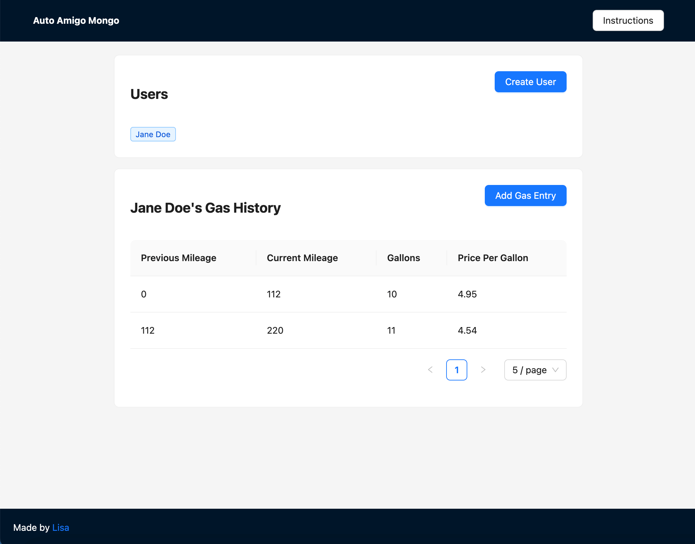

# Auto Amigo Mongo



You can check it out at https://auto-amigo-mongo.vercel.app/


## About

This is a mini version of Auto Amigo <LINK> to refresh my memory on MongoDB and Mongoose and to try out some tech I haven't used before.

This is a [Next.js](https://nextjs.org/) project bootstrapped with [`create-next-app`](https://github.com/vercel/next.js/tree/canary/packages/create-next-app). I referenced the [MongoDB with Mongoose example](https://github.com/vercel/next.js/tree/canary/examples/with-mongodb-mongoose), but I am using TypeScript and leveraging SWR more.

This project is using Next 13, but to get started quicker, it uses the pages API (instead of the new app router).


## Tech

- React, Next.js, Vercel
- MongoDB, Mongoose, Mongo Atlas
- TypeScript
- SWR
- Axios
- Ant Design

## Getting Started

1. Get a copy of the repo locally
  ```bash
    git clone https://github.com/Zhusufeng/auto-amigo-mongo.git
  ```
2. Install the dependencies
  ```bash
    npm i
  ```
2. Get MongoDB up and running.
    1. If you don't have a MongoDB and have Docker, you can create one using the following command:
      ```bash
        docker run -d -p 27017:27017 --name my-mongo-db mongo
      ```
4. Create a database in your MongoDB. I named mine "auto-amigo-mongo".
5. Create a copy of the file `env.local.example` and rename it `env.local`. Add in your MongoDB connection string.
6. Run the development server.
  ```bash
    npm run dev
  ```
7. Go to your browser to view it at http://localhost:3000/
